# Bilimuzhi 🎬✨

> 🌐 **语言 / Language**:[中文](./README.md) · [English](./README.en.md) · [日本語](./README.ja.md)

<p align="center">
  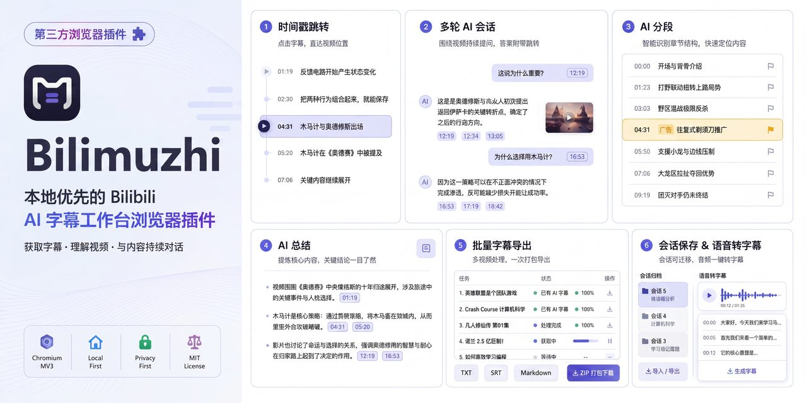
</p>

<p align="center">
  <span style="display:inline-block;padding:3px 12px;border-radius:999px;background:#6e7781;color:#fff;font-size:11px;font-weight:600;letter-spacing:1px;margin:2px;">BILIBILI</span>
  <span style="display:inline-block;padding:3px 12px;border-radius:999px;background:#0969da;color:#fff;font-size:11px;font-weight:600;letter-spacing:1px;margin:2px;">AI SUBTITLES</span>
  <span style="display:inline-block;padding:3px 12px;border-radius:999px;background:#6e7781;color:#fff;font-size:11px;font-weight:600;letter-spacing:1px;margin:2px;">CHROMIUM MV3</span>
  <span style="display:inline-block;padding:3px 12px;border-radius:999px;background:#24292f;color:#fff;font-size:11px;font-weight:600;letter-spacing:1px;margin:2px;">LOCAL FIRST</span>
  <span style="display:inline-block;padding:3px 0 3px 12px;border-radius:999px 0 0 999px;background:#57606a;color:#fff;font-size:11px;font-weight:600;letter-spacing:1px;margin:2px 0;">LICENSE</span><span style="display:inline-block;padding:3px 12px 3px 6px;border-radius:0 999px 999px 0;background:#bf3989;color:#fff;font-size:11px;font-weight:600;letter-spacing:1px;margin:2px;">MIT</span>
</p>

---

**项目描述**:Bilimuzhi是一款纯本地优先的 Bilibili 视频 AI 字幕工作台浏览器插件。围绕「看懂视频」这一目标设计:打开任意 B 站视频页,即可获取官方/AI/多语言字幕轨道,或通过语音转字幕为无字幕视频生成字幕;随后借助 AI 一键分段(自动识别广告片段)、一键总结(简要/平衡/详细三档,正文内嵌可点击跳转的时间戳)与支持图文输入的多轮对话,快速掌握视频大意、建立目录索引。批量模式支持六类来源(单视频、用户主页、收藏夹、合集、分P、搜索页)批量获取字幕或批量语音转字幕,并以 TXT/SRT/Markdown/ZIP 统一导出,便于整理知识库。会话与批量双模式各自拥有独立的归档站(标签、置顶、拖拽排序)与回收站(7/30/365 天/自定义/永久自动清理);密码加密的备份导出/导入可长期保存会话、字幕与 AI 产物。隐私优先:无遥测、无云端账号,API Key 仅存本地,AI 对话直连你选择的服务商;字幕与 Cookie 处理全部在本地浏览器完成。项目基于 Chromium 内核浏览器(MV3)运行,界面支持简体中文/繁體中文/English/日本語。

**核心特点**:

- 🎙️ **字幕获取 + 语音转字幕**:官方/AI/多语言字幕轨道,无字幕视频也能一键转出字幕;
- 🧠 **AI 分段 / 总结 / 对话**:段落标题+概述、三档总结、图文对话,时间戳点击跳转;
- 📦 **批量处理**:六类来源(视频/分P/合集/收藏夹/主页/搜索页)批量获取与导出(TXT/SRT/Markdown/ZIP),搭建个人知识库;
- 🔒 **隐私优先**:无遥测、无云端账号,API Key 仅存本地浏览器。

## 🔥 功能亮点

### 特大亮点

- 🔥 **会话模式 + 批量模式双模式**:各自独立的工作区、归档站、回收站,互不干扰。
- ⏱️ **时间轴模式**:虚拟化字幕时间轴,点击任意字幕行跳转播放器对应时间;"同步模式"开关让当前字幕持续跟随播放器居中高亮。
- 📑 **分段模式**:AI 自动把视频分成多个段落,每段有标题与概述,点击段落即可跳转到对应时间观看;广告片段自动识别。
- 📝 **总结三档**:简要 / 平衡 / 详细,可自选;总结文本内嵌**时间超链接**,点击即跳转视频对应时间。

### 大亮点

- 💬 **多轮 AI 对话**:一个视频可创建多个对话线程;对话中可发送**图片并附带当前视频时间戳**;对话输出中的时间按钮同样可跳转播放器。
- 📦 **批量模式**:六类来源(单视频、用户主页、收藏夹、合集、分P、搜索页)批量获取字幕或批量语音转字幕;支持**多个批量列表**;TXT/SRT/Markdown/ZIP 批量导出。
- 🎙️ **语音转字幕**:适配 Groq 免费额度;FFmpeg WASM 本地分片处理;**交叉模式**在奇偶分片间轮换两个模型,分散配额、降低触发限流概率;支持中文/英文/其他/混合四种语言模式。

### 其他亮点

- 🗂️ **归档 + 标签系统**:会话模式归档区支持标签(上限 200 个,名称 ≤20 字),置顶与拖拽排序;批量模式亦有独立归档站。
- 🗑️ **回收站 + 自动清理期限**:双模式各有回收站,期限支持 7 天 / 30 天 / 365 天 / 自定义 / 永久保留;到期自动清理。
- 💾 **备份与长期保存**:密码加密导出/导入,可长期保存会话、字幕、AI 产物;恢复后原样还原。
- 🌐 **多 AI 服务商**:OpenAI、OpenRouter、DeepSeek、Gemini、Groq、Claude、智谱、ModelScope、Kimi、MiMo 及自定义 Provider;每服务商独立 API Key。
- 🎨 **精美 UI**:浅色 / 深色 / 跟随系统主题,固定蓝色强调色,可拖拽双栏,界面支持简体中文 / 繁體中文 / English / 日本語。

### ⏱️ 时间戳跳转特性

Bilimuzhi 在**总结模式**与**对话模式**的正文中可嵌入**可点击跳转的时间戳**,其行为如下:

- 若**当前页面正是对应视频**:点击时间戳直接跳转到该位置;
- 若**已打开该视频标签页但不在当前页**:自动切换到该标签页并跳转到对应位置;
- 若**未打开该视频标签页**:询问是否打开该视频,确认后打开并跳转到对应位置。

**核心特点**:

- 🎙️ **字幕获取 + 语音转字幕**:官方/AI/多语言字幕轨道,无字幕视频也能一键转出字幕;
- 🧠 **AI 分段 / 总结 / 对话**:段落标题+概述、三档总结、图文对话,时间戳点击跳转;
- 📦 **批量处理**:六类来源(视频/分P/合集/收藏夹/主页/搜索页)批量获取与导出(TXT/SRT/Markdown/ZIP),搭建个人知识库;
- 🔒 **隐私优先**:无遥测、无云端账号,API Key 仅存本地浏览器。

## 🎯 适用场景

- 视频不想逐帧看,只要**了解大意**;
- **画面重要性几乎为 0** 的视频(播客、博客、口播类),纯听/纯读即可;
- 需要为视频建立**目录索引**,快速定位某段内容;
- 整理 **AI 知识库**:字幕归档、标签、检索、导出。

## 🚀 典型工作流

1. **打开视频 → 获取字幕**:打开任意 B 站视频页 → 打开Bilimuzhi → "获取视频自带字幕"(官方/AI/多语言轨道任选)或"语音转字幕"(无字幕视频)。
2. **AI 快速理解**:一键分段(每段标题+概述)→ 一键总结(简要/平衡/详细三档)→ 点击总结/分段里的时间链接随时跳回视频对应位置细看。
3. **多轮追问**:针对看不懂的片段开对话,发图 + 当前时间戳让 AI 结合画面上下文回答;对话输出里的时间按钮直接跳转。
4. **长期保存**:看完归档 + 打标签 + 设回收站期限,密码加密备份,随时恢复。
5. **批量处理**:多个视频(主页/收藏夹/合集/分P/搜索页)一次批量获取或语音转字幕,统一导出 TXT/SRT/Markdown/ZIP 建立资料库。

## 🛠️ 安装与快速开始

**前置**:基于 Chromium 内核的浏览器(Chrome、Edge、Brave、Vivaldi、Opera 等,MV3,最低 Chromium 114)。

```bash
npm ci
npm run build
```

1. 打开浏览器扩展管理页(Chrome 系为 `chrome://extensions`,Edge 为 `edge://extensions`,其他基于 Chromium 内核的浏览器入口类似);
2. 开启"开发者模式";
3. 点击"加载已解压的扩展程序",选择 `dist/extension` 目录。

**首次使用**:打开任意 B 站视频页 → 点击扩展图标打开Bilimuzhi → "获取视频自带字幕"或"语音转字幕"。

> 💡 不想从源码构建?可在 [GitHub Releases](https://github.com/StaySound4/bilimuzhi/releases) 下载打包版 ZIP,解压后通过开发者模式加载安装。

**API Key 配置**:在设置中自行填写(仅存本地浏览器)。

## 🔒 安全与隐私承诺

- **无遥测、无统计、无云端账号**;
- **API Key 仅存于浏览器本地存储**,公共界面只显示"是否已配置";
- **AI 对话仅在用户配置 Key 后直连用户选择的服务商**;
- **不绕过登录、付费、DRM、地区限制;不支持充电视频字幕获取**;
- **字幕与 Cookie 处理均在本地浏览器完成**;详见 [隐私政策](PRIVACY.zh-CN.md) 与 [风险告知](RISKS.md)。

## ⚠️ 已知限制

- 仅支持 Bilibili;仅基于 Chromium 内核的浏览器 MV3 Side Panel(不支持 Firefox/Safari 等非 Chromium 内核浏览器);
- **不支持充电视频/付费内容字幕获取**;
- 页面内 fetch/XHR 字幕捕获未完成(当前走官方字幕接口路径);
- 语音转字幕依赖 Groq 免费额度,存在速率限制;
- 批量来源在 B 站接口变动时可能失效;
- 设计目标支持万行级字幕(10,000 行)与 500 条消息量级,该规模的自动化性能门禁尚未完成,极端规模未做压力测试。

## 📸 界面预览

### 会话与字幕获取

| 截图 | 说明 |
|---|---|
| 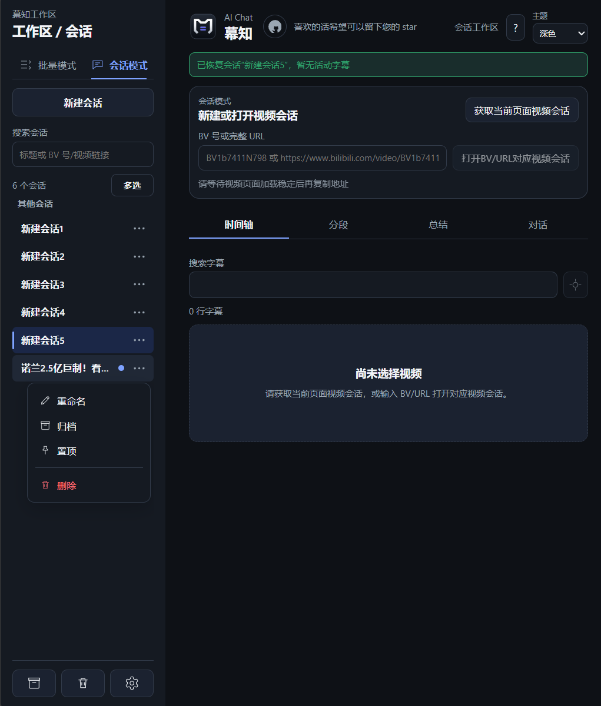 | 会话管理:新建/搜索/归档会话,支持 BV 号或完整链接打开视频会话 |
| 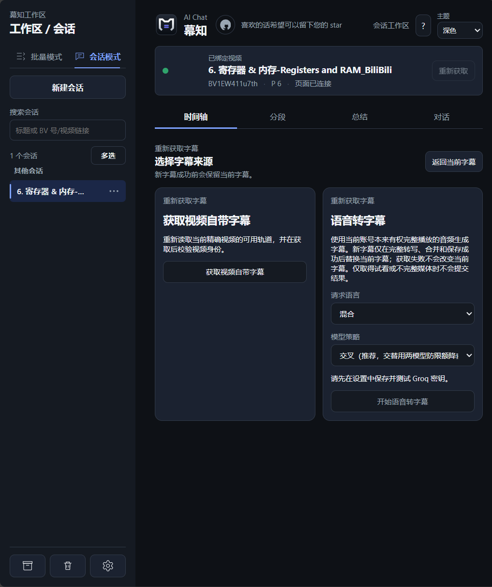 | 时间轴模式:获取视频自带字幕与语音转字幕两种来源 |
| 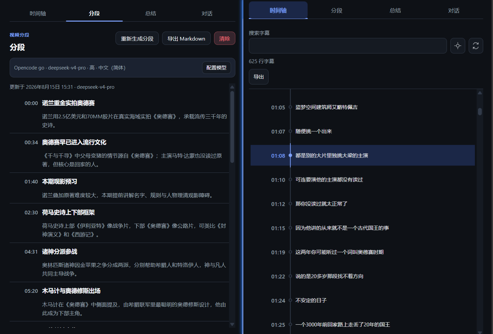 | 分段结果(段落标题+概述+时间戳)与字幕时间轴双视图 |

### AI 能力

| 截图 | 说明 |
|---|---|
| 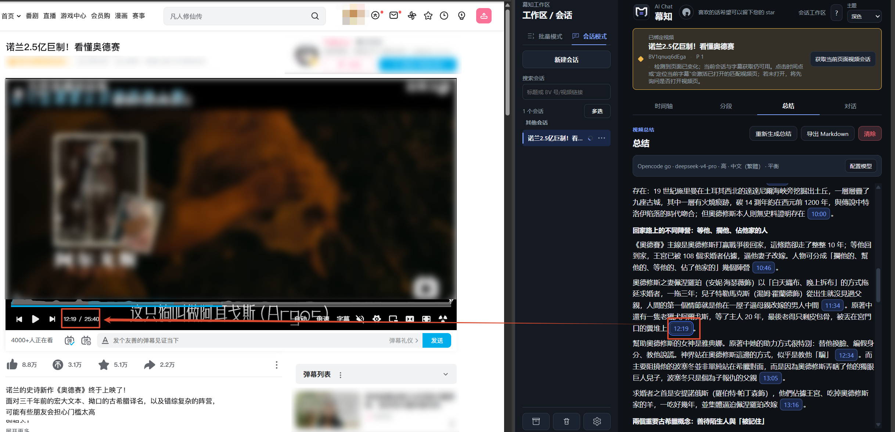 | 总结正文内嵌可点击时间戳,点击即跳转视频对应位置 |
| 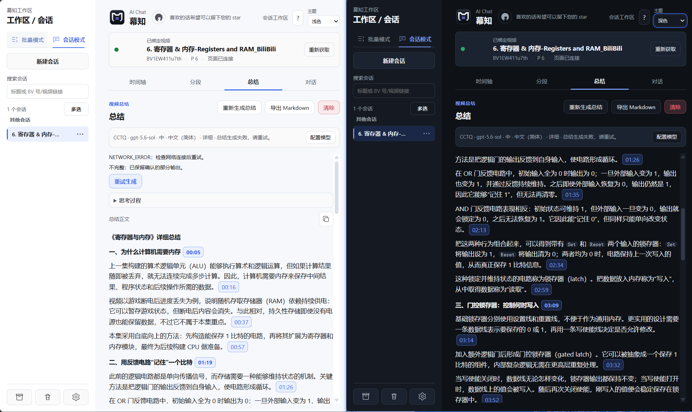 | 浅色/深色主题对照:总结输出与时间戳样式 |
| 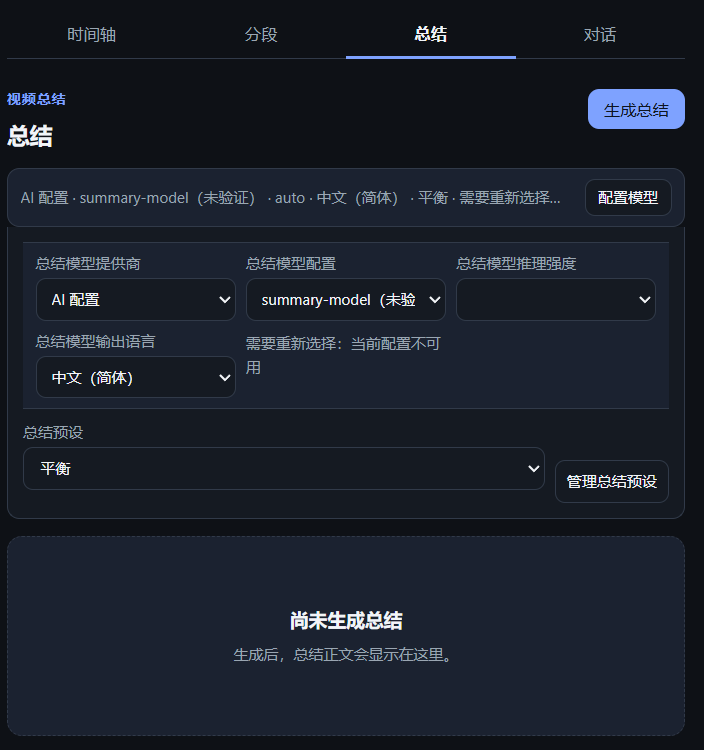 | 各模式输出布局与模型配置(提供商/模型/推理强度/输出语言)高度自定义 |
| 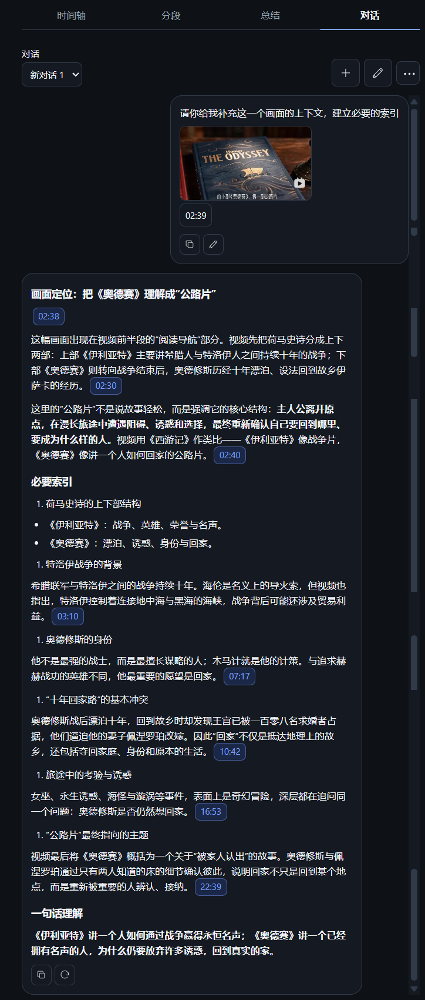 | 多轮 AI 对话:可插入图片(附当前视频时间戳),回复含可跳转时间索引 |
| 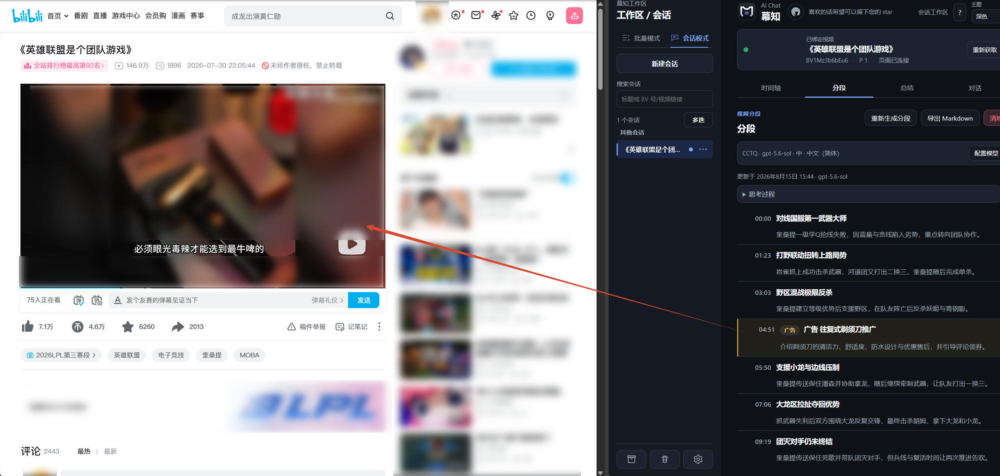 | 分段模式自动识别广告片段 |

### 批量模式

| 截图 | 说明 |
|---|---|
| 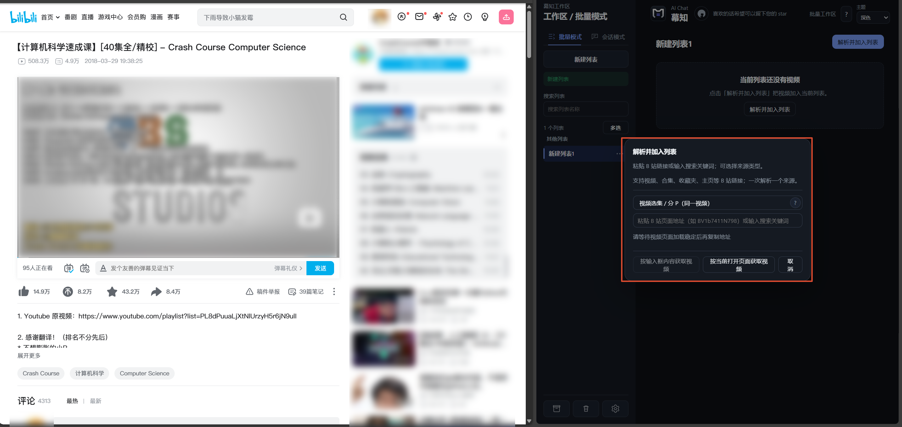 | 六类来源解析:单视频、分P选集、用户主页、收藏夹、合集、搜索 |
| 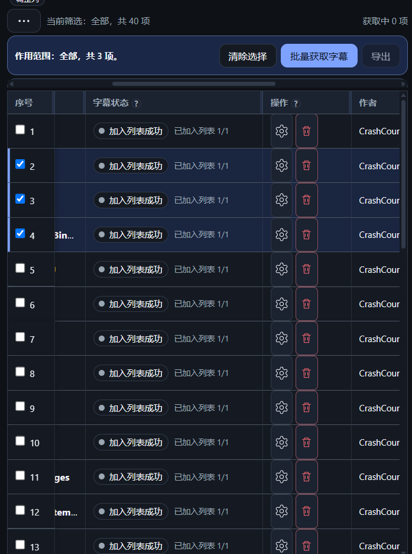 | 批量列表:40 项视频加入列表,逐项状态可见 |
| 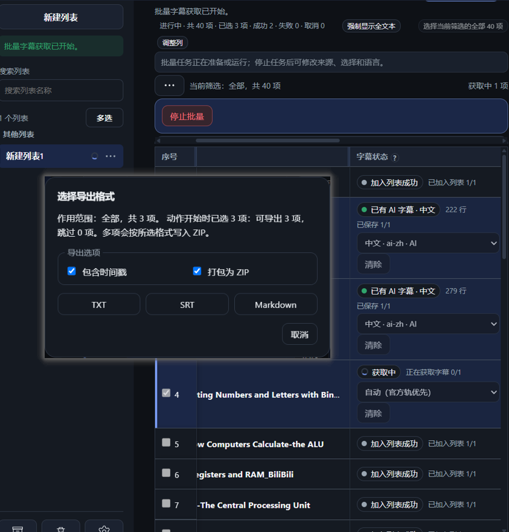 | 批量获取/语音转字幕进行中:状态列转圈与实时进度 |
| 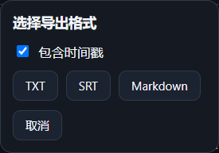 | 批量导出:TXT / SRT / Markdown,可打包 ZIP |

### 其他

| 截图 | 说明 |
|---|---|
| 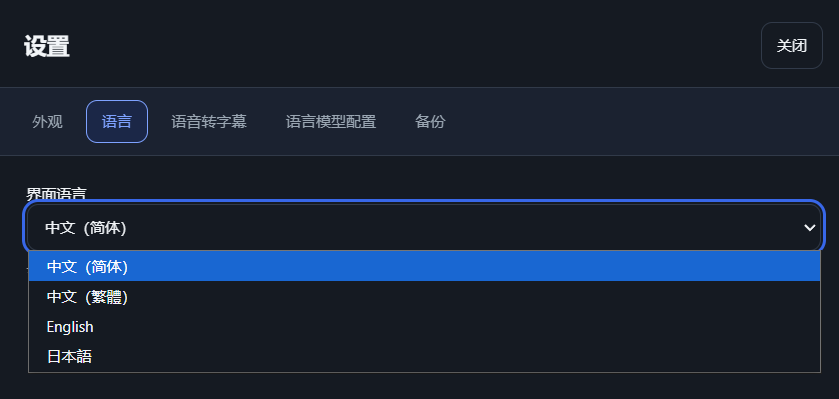 | 界面语言:简体中文 / 繁體中文 / English / 日本語 |

## 💖 支持我

如果你觉得Bilimuzhi对你有帮助,欢迎:

- ⭐ **在 [GitHub](https://github.com/StaySound4/bilimuzhi) 上点个 Star**——你的一颗星,是我深夜写代码时最亮的灯;
- 💬 用着不顺手、发现 bug、有想法想让Bilimuzhi变得更好?欢迎到 [Issues](https://github.com/StaySound4/bilimuzhi/issues) 聊一聊——不用怕说得不专业,把你遇到的、想到的、期望的讲清楚就好,我会认真看每一条;
- 🤝 你会写代码?也欢迎提交 **PR**——比提 Issue 多几步规范:先跑通全部门禁(`npm run check:full` 全绿)、新功能附测试、提交信息遵循格式;完整规则见 [CONTRIBUTING.md](CONTRIBUTING.md),照着做就好,不复杂。

> 项目目前由作者在业余时间维护,回复可能不会那么快,但每条 Issue 和 PR 我都会看到。

## 📚 文档索引

- [隐私政策(中文)](PRIVACY.zh-CN.md) / [Privacy Policy (English)](PRIVACY.en.md)
- [风险告知书](RISKS.md)
- [技术实现说明(机制级)](TECHNICAL.zh-CN.md)
- [贡献指南](CONTRIBUTING.md)
- [行为准则](CODE_OF_CONDUCT.md)
- [安全策略](SECURITY.md)
- [免责声明](DISCLAIMER.md)
- [更新日志](CHANGELOG.md)

## 🎁 致谢与灵感来源

Bilimuzhi 是一个**完全独立开发**的项目:代码、架构、文案均由项目方独立设计与实现。开发过程中,社区中一些优秀的同类产品也启发了我们对交互形态的思考,在此一并致谢:

### SubBatch — B 站字幕批量下载工具

感谢它在批量字幕获取工作流上给社区的启发。

- GitHub 讨论(收录来源):<https://github.com/ruanyf/weekly/issues/8776>
- Chrome 商店:<https://chromewebstore.google.com/detail/subbatch-b%E7%AB%99%E5%AD%97%E5%B9%95%E6%89%B9%E9%87%8F%E4%B8%8B%E8%BD%BD%E5%B7%A5%E5%85%B7/khokmgnfhchkclncfkeccepcamdannoj>
- 开发者 GitHub:itchaox
- B 站主页:<https://space.bilibili.com/521041866>

### Bilitato — AI 陪你刷 B 站

感谢它在 AI 陪伴观影、语音转录与时间戳跳转交互形态上的探索。

- Chrome 商店:<https://chromewebstore.google.com/detail/bilitato-ai%E9%99%AA%E4%BD%A0%E7%9C%8Bb%E7%AB%99/ggddcgdafeeoijoaohcffinbefcbpcga>
- GitHub 项目:<https://github.com/erikzhuang55/Bilitato>
- 开发者 GitHub:erikzhuang55

### 特别致谢 AI 伙伴

最后,特别感谢 **OpenAI ChatGPT** 与 **DeepSeek** 的无私奉献:它们陪我从"这个报错是什么意思"一路问到"帮我把这里重构一下",耐心堪比全天候热线,而且从不反问"你自己不会吗"。正是它们,让代码基础并不强的我也能 vibe coding 出这个项目——如果你在代码风格里发现任何"灵性",那多半是它们深夜加班的痕迹。


> **独立性声明**:Bilimuzhi 的代码、文案与架构均为**独立设计与实现**;不包含上述或任何第三方项目的代码、资源、素材或私有接口,与任何第三方项目无代码级关联。如对著作权有任何疑问,欢迎通过 Issues 联系。

## 📜 开源许可

本项目基于 **MIT License** 开源发布,详见 [LICENSE](LICENSE)。你可以自由使用、修改、分发,包括商用(保留版权与许可声明即可);项目按"原样"提供,不提供任何担保。

**非官方声明**:Bilimuzhi是独立开发的第三方浏览器扩展,**非 B 站官方产品,与哔哩哔哩公司无任何关联**;"Bilibili/哔哩哔哩"为第三方商标,仅用于描述兼容对象。
